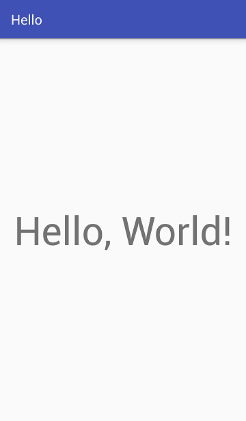

# Hello App

This program is just a standard welcome from a novice developer.

Pre-requisites:

    * Android SDK v26
    * Android Build Tools v27.0.1
    * Android Support Repository v47.0.0
    * Google Repository v58

Getting Started:

This sample uses the Gradle build system. To build this project, use the "gradlew build" command or use "Import Project" in Android Studio or... just start a new Android Studio project with Empty Activity. Well, this is such a fun ritual for a novice developer - to write the program "Hello, World"... :-))) And at the same time, I practised with Git and GitHub!

